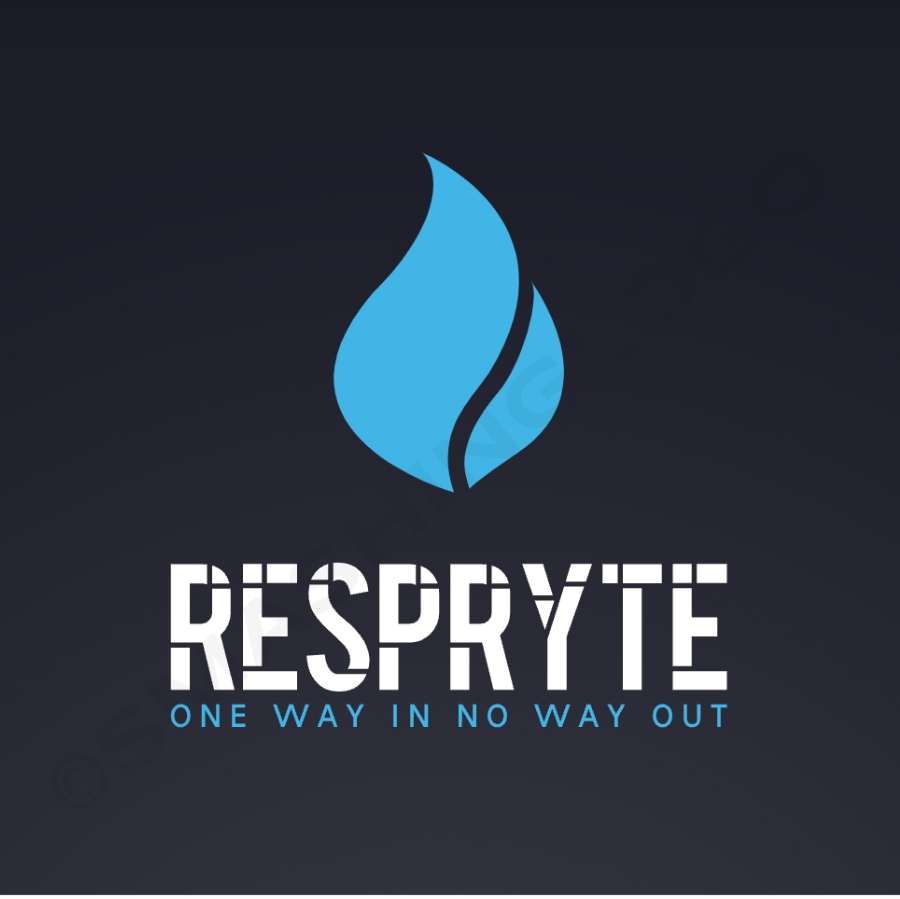

<div align="center">
  
  <!-- 🎮 Game Logo -->
  <!--  -->

  # 🕹️ RESPRYTE
  *A retro-style Android survival game built with Unity.*

  ---
</div>

## 📖 Description

**RESPRYTE** is a **classic 2D retro-style survival game** built for Android using Unity.  
You must run, you must fight, your life is at stake — all wrapped in nostalgic pixel graphics and immersive sound design.

---

## ✨ Features

- 🧟‍♂️ Classic 2D Survival Gameplay  
- 🌲 Movement and Projectile Firing System  
- 🕰️ Retro Pixel Art Style  
- 🎵 Retro SFX  
- 📱 Optimized for Android Devices  
- 💾 Challenge and Leaderboard System  

---

<!-- ## 🎥 Gameplay

> Showcase your gameplay here using a **GIF** or **YouTube video link**.

### 📸 Example:

#### Option 1 – GIF Preview


#### Option 2 – YouTube Demo
[](https://youtu.be/YOUR_VIDEO_ID)

---
-->

## 🧩 Project Setup

### 🛠️ Prerequisites
Make sure you have the following installed:
- **Unity (Version ≥ 2021.3 LTS)**  
- **Android Build Support (SDK + NDK + JDK)**  
- **Git**

## 🚀 Installation Steps

1. **Clone the repository**
   ```
   git clone https://github.com/Spatikam/RESPRYTE.git
   cd RESPRYTE
   ```
2. **Open the project in Unity**
    - Launch Unity Hub
    - Click Open Project
    - Select the cloned folder
    - Wait for Unity to import assets
    - Unity will automatically regenerate the Library/ folder

This might take a few minutes depending on your system

### 📲 Building for Android
1. Go to File → Build Settings

2. Select Android and click Switch Platform

3. Add your main scenes to Scenes in Build

4. Click Build and Run

5. Unity will generate an APK and install it on your connected Android device.

## 🧱 Folder Structure
```
Copy code
📁 Assets/            # Game assets (scenes, scripts, sprites)
📁 Packages/          # Unity package dependencies
📁 ProjectSettings/   # Unity project settings
📁 Screenshots/       # Add screenshots or gameplay GIFs here
📁 Assets/Logo/       # Place your logo image here
.gitignore
README.md
```
<!-- 
📸 Screenshots
Menu	Gameplay	Battle

💡 Future Improvements
🪓 Add more crafting mechanics

🌧️ Dynamic weather system

🕹️ Local multiplayer mode

💬 NPC dialogues and story missions

-->

## 🤝 Contributing
1. Fork the repository

2. Create your feature branch

3. Commit your changes

## 🧠 Tech Stack
🎮 Unity Engine 

📱 Android SDK

💻 **C#**

🎨 Krita

## 📜 License
This project is licensed under the MIT License — see the LICENSE file for details.

---

<div align="center">
“In the end, survival belongs not to the strongest, but to the most adaptable.”
— Retro Survival Game Team

⭐ If you like this project, give it a star on GitHub! ⭐

</div>